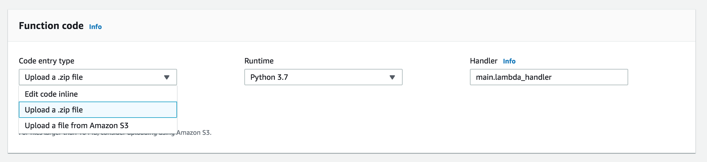
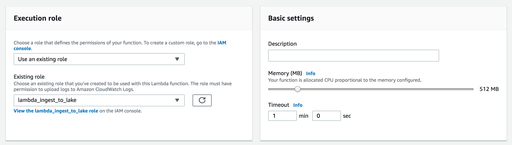

# canary-lambda

## Summary

This canary function is an early warning system that reports corrupt data. It is meant to run once a day on a schedule, sample Amazon Web Services (AWS) Simple Storage Service (S3) data uploaded that day, and then validate that it meets certain field constraints.

It utilizes the [ODE schema validation library](https://github.com/usdot-jpo-ode/ode-output-validator-library) to detect records with missing fields, blank fields, fields that do not match an expected range or value, as well as higher-level validations such as ensuring serial fields are sequential and incremented without gaps.

## Requirements

- [Python 3.7](https://www.python.org/downloads/)
- [PIP](https://pip.pypa.io/en/stable/installing/)
- [AWS Lambda Access](https://aws.amazon.com/lambda/)
- [S3 Permissions within AWS](https://docs.aws.amazon.com/IAM/latest/UserGuide/list_amazons3.html)
  - `s3:Get*`
  - `s3:List*`

## Deployment

This function is deployed manually by uploading a ZIP file to Lambda.

#### Part 1: Local packaging
1. Clone the code
```
git clone https://github.com/usdot-its-jpo-data-portal/canary-lambda.git
```
2. Install dependencies and package the code using the package.sh script:
```
./package.sh
```
3. A zip file named `canary.zip` will be created.

#### Part 2: Deployment to Lambda

1. [Create a Lambda function](https://docs.aws.amazon.com/lambda/latest/dg/getting-started-create-function.html)
  - Select **Python 3.7** as the runtime and **main.lambda_handler** as the handler.
2. Upload the `canary.zip` file

3. Set the Execution role to one that has the S3 and SES permissions listed in the **Requirements** section above.
4. Set the **Memory (MB)** to `512 MB` and the **Timeout** to `1 min 0 sec`.


## Configuration

**Note: This configuration is still in progress and will be added in the future.**

Configuration is _currently_ done in the code (in the future all configuration will be centralized into a CloudFormation template). You may change these values either via the Lambda UI or locally and then repackage your function and reupload the zip.

| Property            | Type             | Default Value | Description                                                                                 |
|---------------------|------------------|---------------|---------------------------------------------------------------------------------------------|
| VERBOSE_OUTPUT      | Boolean          | False         | Increases logging verbosity. Useful for debugging.                                          |
| USE_STATIC_PREFIXES | Boolean          | False         | Overrides the default behavior which is to query for files uploaded today.                  |
| STATIC_PREFIXES     | Array of strings | n/a           | Used with USE_STATIC_PREFIXES to override which files are analyzed.                         |
| S3_BUCKET           | String           | n/a           | Name of the S3 bucket containing data to be validated.                                      |
| DATA_PROVIDERS      | Array of strings | ["wydot"]     | Name(s) of the data providers, used to change which file uploader's data is to be analyzed. |
| MESSAGE_TYPES       | Array of strings | ["bsm"]       | Message type(s) to be analyzed.                                                             |

## Usage

Run the function on a schedule by [setting up a CRON-triggered CloudWatch event](https://docs.aws.amazon.com/AmazonCloudWatch/latest/events/RunLambdaSchedule.html).

## Testing

Run a local test by running the function as a standard python3 script: `python main.py`.

## Limitations

- Cannot validate REST API TIMs
- May report false-positive validation errors if the file contains redacted data (such as data that has been processed by the Privacy Protection Module)

## Future Features

**Upcoming Feature:** Upon detection of erroneous records, this function will automatically distribute an alert message over email with a summary of the failures found.
