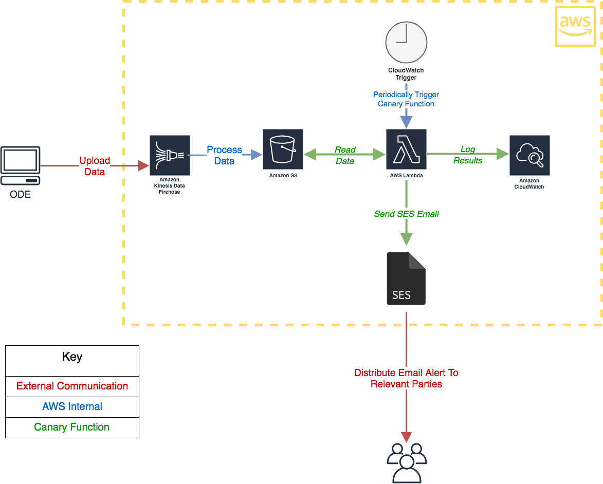
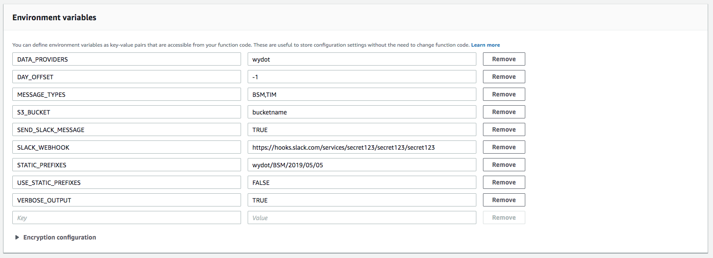

# canary-lambda

## Summary

This canary function is an early warning system that reports corrupt data. It is meant to run once a day on a schedule, sample Amazon Web Services (AWS) Simple Storage Service (S3) data uploaded that day, and then validate that it meets certain field constraints.

It utilizes the [ODE schema validation library](https://github.com/usdot-jpo-ode/ode-output-validator-library) to detect records with missing fields, blank fields, fields that do not match an expected range or value, as well as higher-level validations such as ensuring serial fields are sequential and incremented without gaps.

After the canary completes its execution, it sends a report to Slack.



## Requirements

- [Python 3.7](https://www.python.org/downloads/)
- [PIP](https://pip.pypa.io/en/stable/installing/)
- [AWS Lambda Access](https://aws.amazon.com/lambda/)
- [S3 Permissions within AWS](https://docs.aws.amazon.com/IAM/latest/UserGuide/list_amazons3.html)
  - `s3:Get*`
  - `s3:List*`
- (Optional) Slack and Slack webhook

## Deployment

This function is deployed manually by uploading a ZIP file to Lambda.

#### Part 1: Local packaging
1. Clone the code
```
git clone https://github.com/usdot-its-jpo-data-portal/canary-lambda.git
```
2. Install dependencies and package the code using the package.sh script:
```
./package.sh
```
3. A zip file named `canary.zip` will be created.

#### Part 2: Deployment to Lambda

1. [Create a Lambda function](https://docs.aws.amazon.com/lambda/latest/dg/getting-started-create-function.html)
  - Select **Python 3.7** as the runtime and **main.lambda_handler** as the handler.
2. Upload the `canary.zip` file

3. Set the Execution role to one that has the S3 and SES permissions listed in the **Requirements** section above.
4. Recommended resource settings: **Memory (MB)** `896 MB` and **Timeout** `15 min 0 sec`.

5. Set the environment variables.


## Configuration

These configuration properties are sourced from environment variables. To set them locally, run `export PROPERTY_NAME=Value`, or change them in the **Environment variables** section in the AWS Lambda console.

| Property            | Type             | Default Value | Description                                                                                                             |
| ------------------- | ---------------- | ------------- | ----------------------------------------------------------------------------------------------------------------------- |
| VERBOSE_OUTPUT      | Boolean          | FALSE         | Increases logging verbosity. Useful for debugging.                                                                      |
| USE_STATIC_PREFIXES | Boolean          | FALSE         | Overrides the default behavior which is to query for files uploaded today.                                              |
| STATIC_PREFIXES     | Array of strings | n/a           | Used with USE_STATIC_PREFIXES to override which files are analyzed.                                                     |
| S3_BUCKET           | String           | n/a           | Name of the S3 bucket containing data to be validated.                                                                  |
| DATA_PROVIDERS      | Array of strings | wydot     | Name(s) of the data providers, used to change which file uploader's data is to be analyzed.                             |
| MESSAGE_TYPES       | Array of strings | BSM,TIM       | Message type(s) to be analyzed.                                                                                         |
| SEND_SLACK_MESSAGE  | Boolean          | TRUE          | Upon completion, function will send execution report to slack.                                                          |
| SLACK_WEBHOOK       | String           | n/a           | **WARNING - SECRET!** Slack app integration webhook url to which reports are sent.                                      |
| DAY_OFFSET          | Integer          | -1            | How many days after today should the timestamp be offset. Default to yesterday. Useful when working with CRON triggers. |

## Usage

Run the function on a schedule by [setting up a CRON-triggered CloudWatch event](https://docs.aws.amazon.com/AmazonCloudWatch/latest/events/RunLambdaSchedule.html). (Note that the Cloudformation template includes a once-a-day CloudWatch trigger event at 12:01AM UTC).

## Testing

Run a local test by running the function as a standard python3 script: `python main.py`.

## Release Notes

### Version 0.0.3
- Added error list to output
- Added serialID to output
- Removed file list from output

### Version 0.0.2
- Added `DAY_OFFSET` configuration property to allow the canary to automatically analyze data from days different than the current one
- Updated canary with support for latest [odevalidator v0.0.4](https://github.com/usdot-jpo-ode/ode-output-validator-library/releases/tag/odevalidator-0.0.4) library changes (including support for analyzing TIMs)
- Bugfixes and cleanup

### Version 0.0.1
- Initial functional version
